# Use Case
Merle Hessel (accountName: annamae.mohr )  leiht sich etwas von Joanny Nicolas  (accountName: jackeline.rath).
Merle bekommt das falsche Produkt und erstellt einen Konflikt.
Der Admin gibt ihr Recht und bricht  den Vertrag ab.

## Merle startet auf der main page
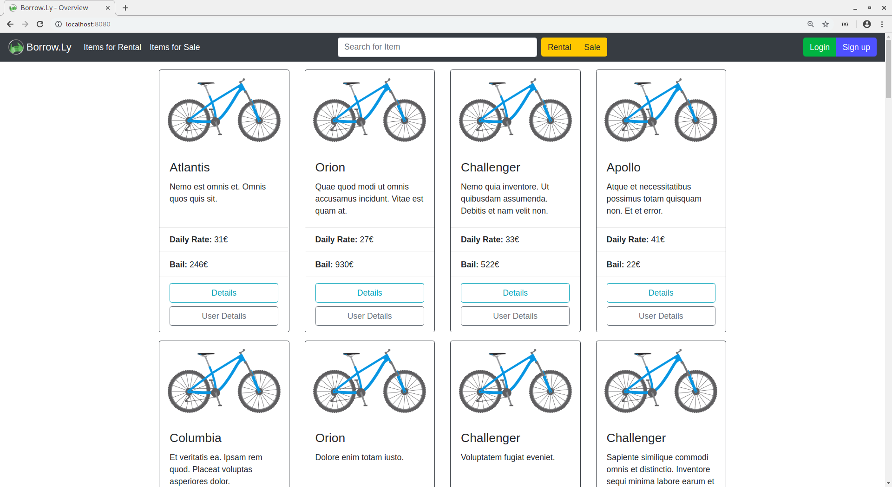

## Nun logged sie sicht mit ihrem accountName ein
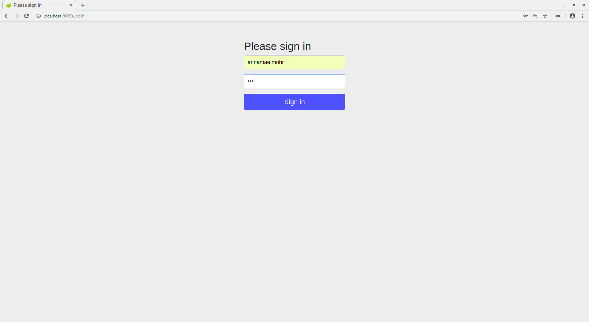

## Sie hat das Produkt Orion auf der main page gefunden und auf Details geklickt
Nun sieht sie alle Produkt details. Im Kalendar kann sie sehen, dass das Produkt noch nicht
für diesen Zeitraum ausgeliehen ist. Es ist also verfügbar. Also klick sie request loan.

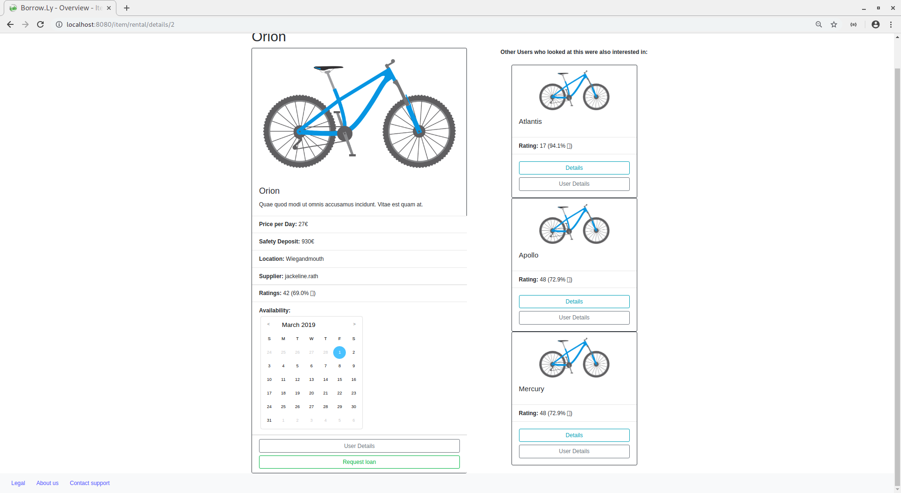

## Nun kann sie aussuchen in welchem Zeitraum sie das Produkt leihen will.
Nach dem sie sich den Zeitraum aussucht, klickt sie auf Borrow.

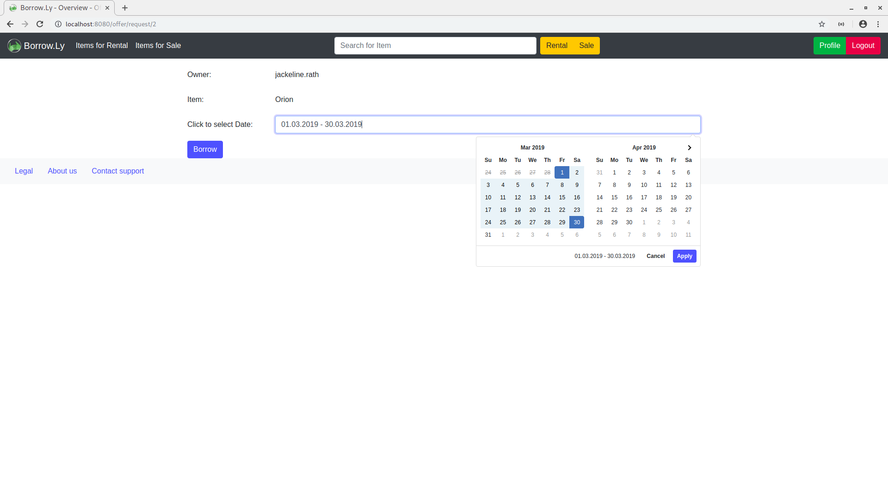

## Die Ausleiherin Joanny logged sich nun in ihren Account

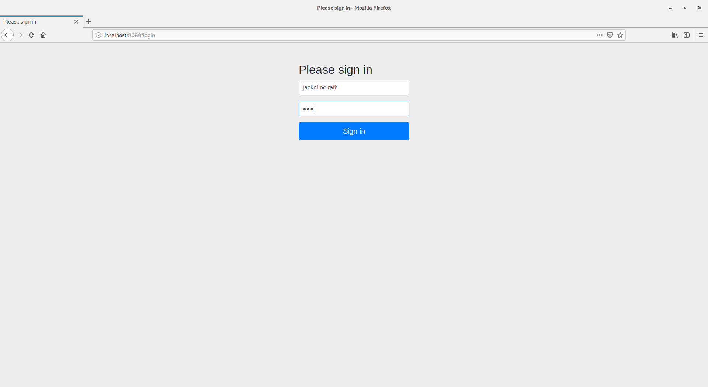

## In ihrem Profil klick sie nun auf Offer items

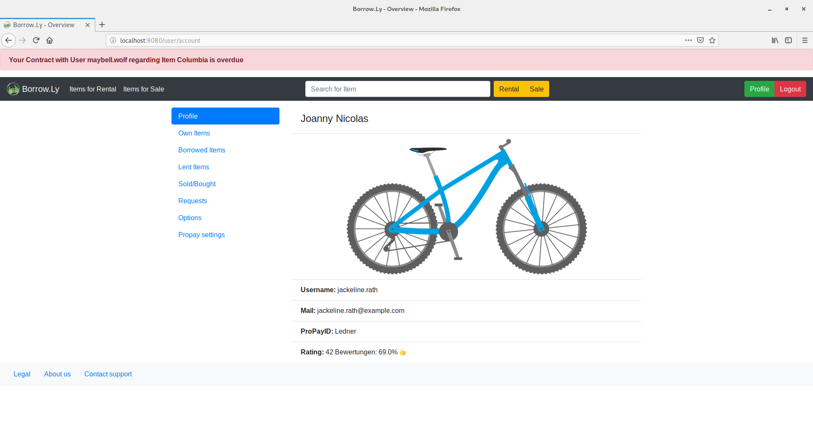

##  Nun kann sie die Anfrage von Merle sehen und bestätigt sie

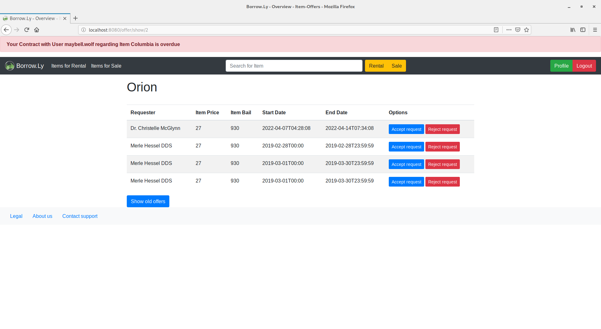

## Merle kann nun unter Borrowed Items in ihrem Profil ihre ausgeliehenen Produkte sehen
Nun klickt sie auf Open Conlict

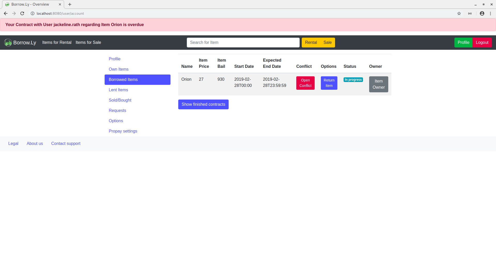

## Sie kann ihr Problem beschreiben und den Konflik bestätigen

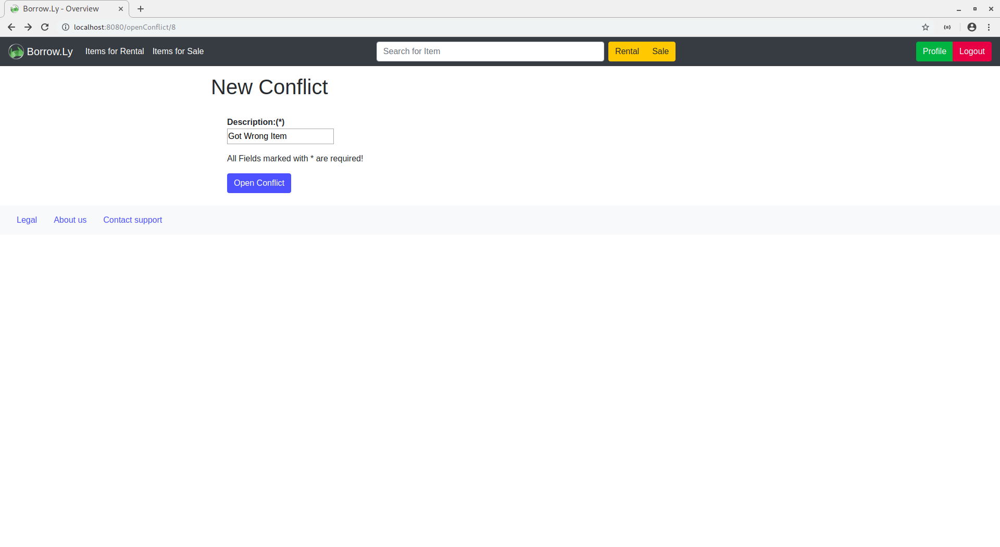

## Joanny sieht nun in den Alerts ganz oben, dass sie in einem Konflik verwickelt ist

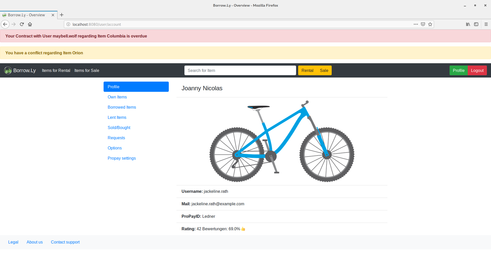

## Der Admin kann nun unter conflicts/show diesen Konflikt sehen
Er/Sie klickt auf die detail view

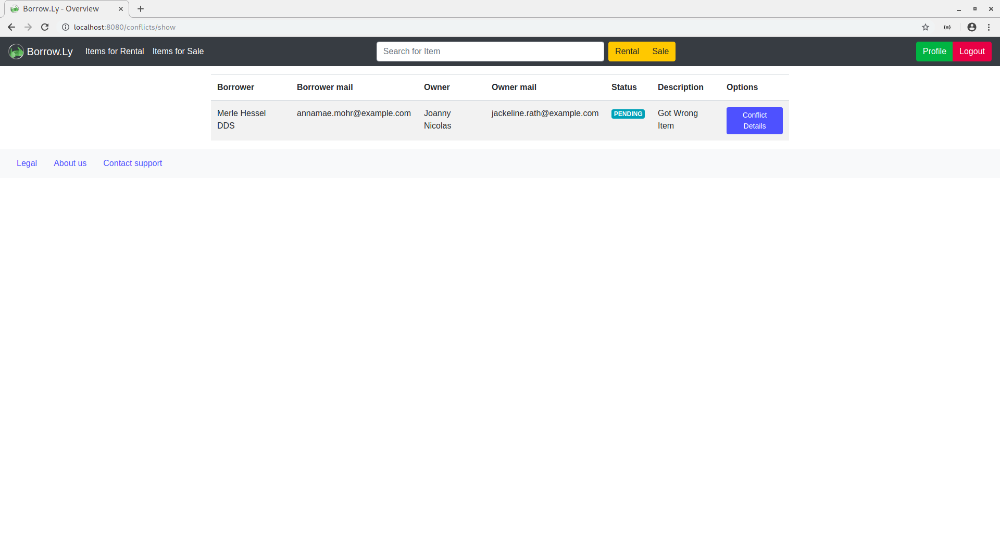

## Hier werden alle informatioen zu den betroffenem Konflikt dargestellt
Die Emails können genutzt werden, um mit beiden Parteien zu sprechen.
Er/Sie entscheidet sich den Contract zu canceln

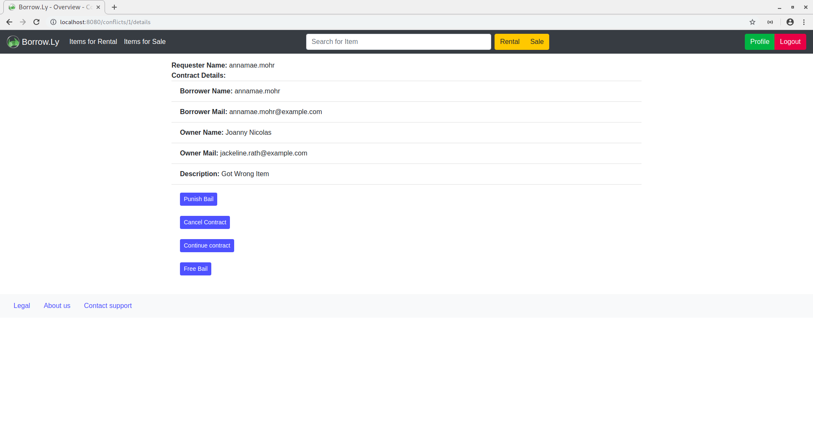

## NUn wird kein Konflikt mehr angezeigt

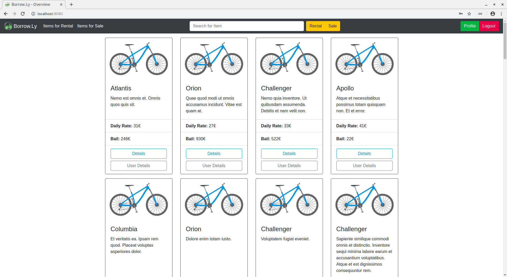