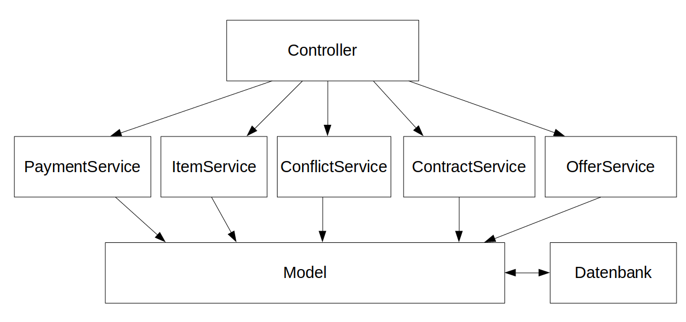

[[section-runtime-view]]
== Laufzeitsicht
Die während der Laufzeit benötigten Daten werden den views von den zuständigen Controllern
übergeben. Diese greifen wiederum auf die jeweiligen Services zu, welche für die Logik
zuständig sind. Im Folgenden werden ein paar beispielhafte Laufzeit-Interaktionen skizziert
um dies beispielhaft zu verdeutlichen.

=== _Registrierung als neuer Nutzer_

* Damit Besucher der Platform auf eine andere Seite zugreifen können als die Hauptseite,
müssen sie sich registrieren

* Es existiert ein gut sichtbarer "Sign Up" button, der das Formular zur Registrierung
neuer Benutzer öffnet

* In der View wird mit Thymeleaf im Formular auf die Felder des Model-objekts "User" verwiesen

* Bestätigt der User seine Eingaben, erhält der UserController ein neues Objekt der Klasse
User mit den angegebenen Werten, welches über den Userservice validiert und im UserRepo persistiert wird

* Hat der Nutzer keine ProPayId angegeben, wird ihm später ein Konto erstellt

* Bei erfolgreicher Erstellung des Users wird er über SpringSecurity automatisch eingeloggt

=== _Als Bestehender Nutzer anmelden/abmelden_

* Über den Login Button in der Navigation Bar gelangt der nicht angemeldete Benutzer auf die Loginseite von Spring Security

* Durch die Eingabe und Bestätigung des bei der Registrierung festgelegten Accountnamen und Passworts kann sich
der Nutzer auf der Seite anmelden, worauf er auf seine Accountseite weitergeleitet wird

=== _Ausleihe eines Items anfragen_

* Der angemeldete Benutzer sieht auf der Hauptseite die angebotenen Gegenstände, welche aus
dem ItemRepo ausgelesen werden und öffnet die Detailseite eines Gegenstands.

* Der ItemRentalController überprüft ob das Item dem Nutzer gehört, und übergibt diese Information
an die View

* Auf der Detailseite kann der Nutzer in einem Kalender sehen, in was für einem Zeitraum
der Gegenstand vorrausichtlich verfügbar ist. Dies wird dadurch erreicht, dass die geplanten Laufzeiten der
bestehenden "Contracts" des Gegenstands auf dem Kalender markiert werden

* Der Nutzer erfragt eine Ausleihe über einen Button im unteren Teil der Ansicht

* Der Offercontroller liefert die Anfrageseite und erlaubt dem Nutzer die Festlegung seines bevorzugten
Zeitraums

* Nach der Bestätigung des Nutzers wird die benötigte Kaution und die zu erwartende Leihgebühr bei ProPay
reserviert und über den Offerservice eine Offer erstellt

=== _Annahme einer Anfrage_

* Der Besitzer eines angefragten Items kann auf seiner Accountseite eine Liste seiner erstellten Items sehen.

* Für jedes Item wird die Anzahl der offenen Anfragen angezeigt und durch einen Klick auf diese Anzeige
sieht der Besitzer eine Auflistung ebendieser

* Mit Hilfe zweier Schaltflächen kann der Besitzer diese annehmen, beziehungsweise ablehnen

* Durch die Annahme wird ein BorrowContract initialisiert

=== _Rückgabe eines ausgeliehenen Items_

* Der Ausleihende findet auf der Accountseite eine Übersicht seiner ausgeliehenen Items. An dieser Stelle
kann er über den Button "Return Item" den Gegenstand zurückgeben

* Diese Aktion löst auch die Verrechnung des BorrowContracts aus. Er berechnet die benötigten Transaktionen
und initialisiert die Zahlung über die PropayApi

=== _Item zum Verleih oder Verkauf anbieten_

* Der Interessent findet auf der Accountseite unter dem Reiter "Options" die Möglichkeit einen Gegenstand
einzustellen

* Die jeweilige Formularseite bereitet über Thymeleaf ein Objekt der Klasse ItemRental, beziehungsweise ItemSale vor,
in dem der Nutzer die wichtigen Daten für den Gegenstand eintragen kann

* Durch die Bestätigung wird dem Controller das Objekt der jeweiligen Klasse übergeben, welcher den ItemService
verwendet um es zu persistieren

* Danach ist das Item in der jeweiligen "Mainpage" und im Profil unter "Own Items" zu sehen

=== _Item kaufen_

* Im Banner der Weboberfläche lässt sich jederzeit die SalePage aufrufen, auf der die zum Verkauf angebotenen
Gegenstände aufgelistet werden

* Über die jeweilige Detailseite kann der angemeldete Benutzer Items Kaufen, die ihm nicht gehören

* Hierfür ist es nicht nötig eine Anfrage zu erstellen, da mit der Bestätigung direkt ein SellContract erstellt
und verrechnet wird

* Das hierdurch gekaufte Item kann in der Accountpage unter "Items Sold/Bought" eingesehen werden

=== _Benutzerdaten ändern_

* Der Benutzer kann auf der Accountseite seine Accountdaten ändern

* Der Controller holt sich das passende Userobjekt und übergibt es der UserForm

* Die View erkennt über Thymeleaf ob sie ein bestehendes Objekt erhalten hat und passt dementsprechend
die angezeigten Felder an

* Der Nutzer kann alle Felder bis auf Passwort und AccounName nach Belieben ändern und die Änderungen
bestätigen. Die Änderungen werden vom Controller mithilfe des UserService persistiert

=== _Items ändern_

* Der Nutzer sieht auf seiner Accountseite eine Auflistung seiner angebotenen Items

* Durch einen Klick auf den button "Details" wird er auf die bereits bekannte Detailansicht geleitet

* Der ItemController erkennt dass der eingeloggte Benutzer der Besitzer ist und gibt diese Information an die View
weiter

* Auf der Detailseite sieht der Besitzer des Items einen Button zum editieren ebendieses, anstelle
der Buttons zum ausleihen oder kaufen des Items

* Der Button zum bearbeiten verlinkt auf die bereits bekannten Formularseiten, allerdings fügt der
jeweilige ItemContoller das zu bearbeitende Item-Objekt der View hinzu

* Bei der Bestätigung der Änderungen werden die Objekte vom Controller zwecks Speicherung an den ItemService
übergeben

=== _Transaktionen einsehen_

* Der eingeloggte Benutzer kann auf der Accountseite seine aktiven und vergangenen Transaktionen anzeigen lassen

* Die aktiven BorrowContracts werden in der Übersicht oben angezeigt, die vergangenen unten

* Abgeschlossene SellContracts werden in einem anderen Reiter aufgelistet und danach geordnet, ob etwas ge- oder
verkauft wurde

=== _Konflikte erstellen_

* In der Auflistung der aktiven Contracts kann der Nutzer, unabhängig davon ob er Itembesitzer ist oder nicht,
einen Konflikt eröffnen

=== _Konflikte lösen_

*

=== _ProPay Konto verwalten_

* Auf seiner Accountseite kann der Nutzer seine PropayId ändern und sein Guthaben aufladen

* Die Kommunikation mit Propay erfolgt hier über die ProPayApi
